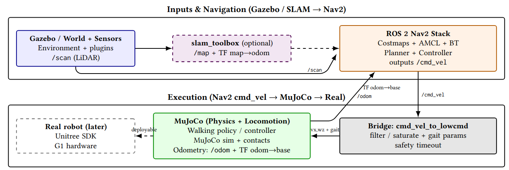

# Navigation-Aware Hybrid Execution Stack for Unitree G1
## Hybrid Navigation + Locomotion (Gazebo/Nav2 + MuJoCo + Real)


[](https://ubuntu.com/)
[](https://www.apple.com/macos/)
[](https://wiki.ros.org/noetic)
[](https://wiki.ros.org/foxy)
[](https://navigation.ros.org/)
[](https://github.com/SteveMacenski/slam_toolbox)
[](https://www.unitree.com/)
[]()
[](http://gazebosim.org/)
[](https://mujoco.org/)
[](https://opensource.org/license/apache-2-0)

This repository implements **a navigation-driven hybrid execution framework** for the Unitree G1 humanoid robot.
It builds upon the locomotion pipeline provided by [rl_sar](https://github.com/fan-ziqi/rl_sar) (Ziqi Fan) which offers a robust SIM–REAL reinforcement learning locomotion stack.

We extend and adapt this pipeline to integrate:

- ROS 2 Nav2-based SLAM and global planning

- Navigation-driven /cmd_vel control

- MuJoCo–Gazebo pose synchronization

- Structured deployment workflow for real robot execution

While [rl_sar](https://github.com/fan-ziqi/rl_sar) focuses on locomotion policy deployment,
this project introduces a navigation-first architecture, where high-level planning and SLAM drive physics-grounded RL locomotion in a unified execution stack.

The same command interface (/cmd_vel) is preserved across all deployment levels:

Simulation (Gazebo + MuJoCo)
        ↓
Hardware-in-the-loop testing
        ↓
Real robot execution (Unitree G1 / G1 EDU23)

This enables consistent experimentation and reproducible evaluation from simulation to hardware.

## Hybrid Execution Architecture
The system is organized into four interacting layers:

**1️⃣ Navigation Layer (ROS 2 Nav2 + SLAM)**

- Mapping via slam_toolbox

- Localization

- Global and local planning

- /cmd_vel generation

Nav2 decides **where the robot should move**.

**2️⃣ Locomotion Layer (MuJoCo + RL Policy)**

- Physics-grounded locomotion

- 29-DoF Robomimic-based RL controller

- Joint remapping from policy space (29 DoF) to hardware space (23 active joints on EDU23)

The RL controller determines **how the robot walks**.

**3️⃣ Hybrid Bridge Layer**

A dedicated bridge ensures consistency between navigation and locomotion:

- /cmd_vel filtering and saturation

- Safety timeouts (freshness gating)

- Gait parameter handling

- Pose synchronization (MuJoCo → Gazebo)

- Unified interface for simulation and real deployment

This layer guarantees that planning outputs are safely transformed into locomotion inputs.

**4️⃣ Deployment Layer (SIM → REAL)**

The framework supports multiple runtime modes:

- Simulation (MuJoCo only)

- Hybrid Gazebo + MuJoCo navigation

- Fake LowState testing (safe debugging)

- Real robot mode via Unitree SDK2

All modes share the same execution logic and command interface.

**Core Design Principle**

The architecture follows a strict separation of responsibilities:

  - Navigation decides where to go

  - RL locomotion decides how to walk

  - The bridge guarantees execution consistency

This modular structure enables:

Navigation-aware humanoid locomotion

Stable sim-to-real policy transfer

Controlled evaluation of SLAM + RL stacks

Reproducible experiments across simulation and hardware

---



## Real Robot Deployment Mode

In real deployment mode:

  - The RL locomotion controller runs on the hardware interface

  - Low-level state feedback (LowState) is streamed from the robot (DDS)

  - Nav2 (running on the PC) generates /cmd_vel

  - The bridge applies safety gating before publishing LowCmd

Safety mechanisms include:

  - Command freshness timeout

  - Motor enable sequence

  - Navigation-mode gating

  - Controlled activation of LowCmd publishing

This design ensures consistent behavior across simulation and real-world experiments while preserving hardware safety.

---

## Research Objective

Beyond system integration, this project investigates how:

  - Execution reliability

  - Structured operational modes

  - Transparency in control flow

jointly influence **trust in service robotics**.

Rather than focusing solely on perception or reasoning modules, we emphasize the importance of a validated execution backbone that:

  - Reduces navigation instability

  - Improves motion predictability

  - Supports explainable operational modes

  Enables systematic evaluation of safety and user trust

By unifying simulation, hardware-in-the-loop testing, and real robot deployment under a shared Nav2-based execution substrate, this framework enables principled research on navigation-driven humanoid robotics.


## Requirements

Recommended: **Ubuntu 22.04 + ROS 2 Humble + Gazebo Classic (Gazebo 11)**

### Core dependencies
- C++17 toolchain + CMake
- ROS 2 Humble
- Gazebo Classic + `gazebo_ros_pkgs`
- Nav2 + RViz2
- `yaml-cpp`, `TBB`, `glfw3`
- Python3 (dev headers)
- MuJoCo runtime library:** `libmujoco.so.3.2.7`

---

## Behavior Matrix

This project supports multiple execution modes with a **single binary** (no rebuild),
selected at runtime via ROS 2 parameters.

### Runtime parameters
- `hw_mode`:
  - `0` = `REAL` (reads real robot LowState via DDS)
  - `1` = `FAKE_LOWSTATE` (synthetic LowState, no robot required)
- `fake_rl_full` (only meaningful when `hw_mode=1`):
  - `false` = mapping/cmd_vel checks only (no RL forward)
  - `true`  = full RL forward + logs (still safe if `publish_lowcmd=false`)
- `publish_lowcmd`:
  - `true`  = publish LowCmd to the robot (movement possible)
  - `false` = never publish LowCmd (safe dry-run)

> **Safety rule:** `LowCmd` is published **only** when `hw_mode=REAL` and `publish_lowcmd=true`.

### Mode matrix

| Mode | LowState source | RL Forward | LowCmd computed | LowCmd published | Primary goal |
|---|---|---:|---:|---:|---|
| `REAL` + `publish_lowcmd=true` | Real robot (DDS) | ✅ | ✅ | ✅ | Real robot operation (navigation → locomotion) |
| `REAL` + `publish_lowcmd=false` | Real robot (DDS) | ✅ | ✅ | ❌ | Safe debugging on robot (no motion output) |
| `FAKE_LOWSTATE` + `fake_rl_full=false` | Synthetic | ❌ | ❌ | ❌ | Validate joint mapping + `/cmd_vel` reception only |
| `FAKE_LOWSTATE` + `fake_rl_full=true` + `publish_lowcmd=false` | Synthetic | ✅ | ✅ | ❌ | Full RL pipeline + logs without robot (safe) |


## Install dependencies (Ubuntu 22.04)

```bash
sudo apt update
sudo apt install -y   build-essential cmake git   python3 python3-dev python3-pip   libtbb-dev libyaml-cpp-dev   libglfw3-dev pkg-config

# ROS2 + Nav2 + RViz
sudo apt install -y   ros-humble-rclcpp ros-humble-geometry-msgs   ros-humble-navigation2 ros-humble-nav2-bringup   ros-humble-rviz2   ros-humble-tf2-ros ros-humble-tf2-tools   ros-humble-robot-state-publisher   ros-humble-joint-state-broadcaster   ros-humble-std-srvs

# Gazebo Classic + ROS bridge
sudo apt install -y gazebo
sudo apt install -y ros-humble-gazebo-ros-pkgs ros-humble-gazebo-msgs
```

---

## MuJoCo installation (libmujoco.so.3.2.7)

This repository expects MuJoCo under:

```
rl_hnav/src/rl_sar/library/mujoco/
  include/mujoco/mujoco.h
  lib/libmujoco.so.3.2.7
```

The build also accepts an existing copy at `rl_hnav/library/mujoco/`; CMake
uses it automatically if the location above is absent.

Check:

```bash
ls -lah rl_hnav/src/rl_sar/library/mujoco/lib/libmujoco.so.3.2.7
# Or, for the repository-root copy:
ls -lah rl_hnav/library/mujoco/lib/libmujoco.so.3.2.7
```

If your repo provides a helper script:

```bash
bash rl_hnav/src/rl_sar/run/download_mujoco.sh
```

---

## Clone

```bash
cd ~/
git clone https://github.com/uleroboticsgroup/rl_hnav.git
cd rl_hnav

git submodule update --init --recursive
touch src/rl_sar/src/rl_sar_zoo/COLCON_IGNORE

# Create package.xml symlinks for ROS 2 (rl_sar uses package.ros2.xml)
for d in src/rl_sar/src/robot_msgs src/rl_sar/src/robot_joint_controller src/rl_sar/src/rl_sar; do
  ln -sf package.ros2.xml "$d/package.xml"
done
```

---

## Docker (optional)

Build the image and start the container (requires NVIDIA GPU + `nvidia-container-toolkit`):

```bash
cd ~/rl_hnav
xhost +local:docker # allow GUI forwarding
docker compose -f docker/docker-compose.yml up -d
```

Enter the running container:

```bash
docker exec -it rl_hnav_container bash
```

> Inside the container your workspace is mounted at `/home/developer/rl_hnav`.
> All commands in the **Build** and **Run** sections below are meant to run **inside the container**.

---

## Build (ROS 2 friendly)

```bash
cd ~/rl_hnav
source /opt/ros/humble/setup.bash
colcon build 
source install/setup.bash
```

### Build with MuJoCo enabled (recommended)

```bash
cd ~/rl_hnav
colcon build --cmake-args -DUSE_MUJOCO=ON -DENABLE_REAL_ROBOT=ON
source install/setup.bash
```

---

## Run MuJoCo locomotion (consuming /cmd_vel)

Command (as used in this project):

```bash
source /opt/ros/humble/setup.bash ###(zsh)
source rl_hnav/install/setup.bash ###(zsh)
ros2 run rl_sar rl_mujoco g1 scene_29dof   --ros-args -p navigation_mode:=true -p cmd_vel_timeout_sec:=0.6 -p cmd_vel_topic:=/cmd_vel
```

### Parameters
- `navigation_mode:=true` : use `/cmd_vel` as the command source.
- `cmd_vel_timeout_sec:=0.6` : safety stop if `/cmd_vel` is missing.
- `cmd_vel_topic:=/cmd_vel` : Nav2 default output topic.

---

## Operation procedure (important)

At startup, follow this sequence for safe, stable initialization:

1. In **RViz**, click **Pause** immediately (or pause in the MuJoCo viewer if available).
2. If needed, **Reset** to bring the robot back to a stable standing pose.
3. Press **`0`** to **load the policy**.
4. Press **`1`** to execute **GetUp**.
5. Click **Run/Play** to start stepping and enable locomotion.

Open a new terminal, launch then bring up Nav2 + Gazebo that read (`/odom`) from MuJoCo pose to allow SLAM publishing the map. 
```bash
source /opt/ros/humble/setup.bash ###(.zsh)
source rl_hnav/install/setup.bash ###(.zsh)
ros2 launch g1_nav2 nav_amcl.launch.py
```
After that:
- MuJoCo publishes odometry (`/odom`) and TF (`odom → base`),
- Nav2 publishes `/cmd_vel`,
- the bridge translates `/cmd_vel` into locomotion inputs.

---

## Hybrid simulation: Gazebo + Nav2 + MuJoCo

Typical workflow uses multiple terminals (2):

1) **MuJoCo** locomotion (`rl_mujoco`) 
2) **Gazebo + Bridge + SLAM + Nav2 (from the main pipeline)**
  - **Gazebo Classic** world + sensors  
  - **slam_toolbox** to create `/map`  
  - **Nav2** to produce `/cmd_vel`  
  - **Bridge** to synchronize pose/state 

### Square-loop simulation and DDS library isolation

Use `sim_ros2` in **all three simulation terminals**. It wraps a normal `ros2`
command with a private domain (76 by default), localhost-only DDS discovery,
explicit loopback peers, ROS CycloneDDS libraries, and a separate local Gazebo
master. This avoids other robots on the event LAN publishing conflicting
`/robot_description`, TF, or clock data. Set `G1_SIM_DOMAIN_ID` consistently in
all terminals if another local simulation needs a different domain.

Source ROS and this workspace in each terminal, then:

**Terminal 1 — MuJoCo (operator initializes GetUp and locomotion):**

```bash
ros2 run g1_nav2 sim_ros2 run rl_sar rl_mujoco g1 scene_29dof \
  --ros-args -p navigation_mode:=true -p cmd_vel_timeout_sec:=0.6 -p cmd_vel_topic:=/cmd_vel
```

**Terminal 2 — room, mapping, navigation, and RViz:**

```bash
ros2 run g1_nav2 sim_ros2 launch g1_nav2 nav_amcl.launch.py world_name:=square_loop.world
```

**Terminal 3 — diagnostic commands (also through the wrapper):**

```bash
ros2 run g1_nav2 sim_ros2 topic echo /map --once --no-daemon --field info
```

Stop previous simulation processes before switching to the wrapper. A running
MuJoCo process cannot change its ROS domain; restart it in Terminal 1 and perform
the operator initialization again. The wrapper does not initialize the policy.

The simulation launch prioritizes the ROS installation's libraries for its
Gazebo, SLAM, Nav2, RViz, and bridge child processes. This matters because sourcing
`rl_sar` also exposes the Unitree SDK's bundled `libddsc.so.0`. Loading that SDK
copy into ordinary ROS nodes caused intermittent stale internal TF/robot poses,
even while a new `tf2_echo` process could see current transforms. Keep the SDK
and ROS library environments process-isolated; do not replace system libraries.
The separately started MuJoCo process is not restarted by this launch.

In this simulation, SLAM Toolbox publishes `/slam_toolbox/map_raw` and `/pose`;
`map_odom_tf` exposes `/map` and the single `map -> odom` transform for Nav2.
`navigation_tf_relay` relays only the five recent dynamic transforms in Nav2's
base and LiDAR chain to `/nav_tf` (map/odom/base and the three waist joints).
This keeps Nav2's TF buffers off the full moving G1 skeleton. SLAM and RViz
still use `/tf`; `/tf_static` is shared unchanged. Keep the relay running
with Nav2.
The raw map retains its observation stamp. A fresh `/map` header alone is not
evidence of new observations or working controller feedback. Inspect Nav2's own
footprint timestamp as well:

```bash
ros2 run g1_nav2 sim_ros2 topic echo /local_costmap/published_footprint --once --no-daemon --field header
ros2 run g1_nav2 sim_ros2 topic echo /clock --once --no-daemon
```

The footprint should advance with the simulation clock. Validate a short manual
goal after a sustained idle period, checking actual `/odom` displacement and the
action result. Use `use_rviz:=false` to
run without the viewer; closing RViz no longer shuts down the simulation stack.

### Autonomous frontier exploration (simulation only)

For the complete three-terminal bringup and troubleshooting steps, see
[`explore-ros2-mujoco-gazebo.md`](explore-ros2-mujoco-gazebo.md).

The `robo-friends/m-explore-ros2` source revision is pinned in `exploration.repos`.
From the `rl_hnav` workspace root, on a fresh checkout:

```bash
vcs import src < exploration.repos
git -C src/m-explore-ros2 apply ../../patches/m-explore-ros2-success.patch
source /opt/ros/humble/setup.bash
colcon build --symlink-install --packages-up-to explore_lite g1_nav2
```

Start MuJoCo and the Gazebo/SLAM/Nav2 launch as above. **After** pressing `0`
then `1` and confirming the robot is standing, start the explorer in a third
terminal (source ROS and `install/setup.bash` first):

```bash
ros2 run g1_nav2 sim_ros2 launch g1_nav2 g1_exploration_sim.launch.py
```

This is the explicit exploration opt-in. Its read-only preflight checks active
Nav2, map, odometry, TF, and current controller footprint. If any check fails,
the explorer does not launch. Once started, `explore_lite` automatically selects
frontiers from the full `/map` updates and sends Nav2 `NavigateToPose` goals;
frontier markers appear on `/explore/frontiers` (add a MarkerArray display in
RViz). The explorer uses `base_footprint` and does not return to its starting
position automatically. The local upstream patch keeps an active frontier goal
stable while SLAM updates, and prevents an already reached frontier from being
immediately selected again within Nav2's goal tolerance. To stop,
pause and cancel goals before Ctrl-C:

```bash
ros2 run g1_nav2 sim_ros2 topic pub --once /explore/resume std_msgs/msg/Bool '{data: false}'
```

Check `/explore/status`, `/explore/frontiers`, `/navigate_to_pose/_action/status`
and the robot's `/odom` in the same private simulation graph. Do not launch
this explorer in a real-robot ROS graph.

### Validate topics
```bash
source /opt/ros/humble/setup.bash ###(.zsh)
source rl_hnav/install/setup.bash ###(.zsh)
ros2 topic echo /cmd_vel
ros2 topic list | grep -E "/odom|/tf|/scan|/cmd_vel"
```

### TF chain expectation
Nav2 typically requires:
- `map → odom → base_footprint` (or `base_link` depending on your robot)

---

## RTAB-Map / Nav2 command-only test on the real G1

After syncing the **laptop** to the robot clock and starting `g1_sensors`
`tf_chain.launch.py` plus `g1_mapping` `mapping.launch.py static_tf:=false`, run
only the scan pipeline from this workspace (with the live ROS domain and wired
CycloneDDS interface already configured):

```bash
ros2 run pointcloud_to_laserscan pointcloud_to_laserscan_node --ros-args \
  -r cloud_in:=/utlidar/cloud_livox_mid360 -r scan:=/scan_raw \
  -p target_frame:=robot_center -p transform_tolerance:=0.3 \
  -p min_height:=-0.2 -p max_height:=0.2 -p range_min:=0.2 -p range_max:=8.0

ros2 run humanoid_nav_bridge scan_restamper --ros-args \
  -p input_scan_topic:=/scan_raw -p output_scan_topic:=/scan \
  -p override_stamp:=false
```

Run these in separate terminals, then launch Nav2 in **command-only** mode:

```bash
ros2 launch g1_nav2 rtabmap_nav_dry_run.launch.py
```

This launch leaves `/cmd_vel` unpublished: controller output goes to
`/g1_nav2_dry_run/cmd_vel_raw`, and the smoother and recovery behaviors publish
to `/g1_nav2_dry_run/cmd_vel`. Verify `/cmd_vel` has **zero publishers** before
sending any test goal. It does not start locomotion, SLAM Toolbox, or an odom
bridge. The scan relay subscribes best-effort and publishes reliably for Nav2
costmaps; with synchronized clocks it keeps the original LiDAR stamp.

A standing-only RTAB-Map grid may have almost no traversable free space. In the
initial live test a goal 0.65 m ahead was unknown and Nav2 issued a dry-run
recovery spin rather than a path-following command. Build a map by surveying
with the vendor remote before expecting a planning or frontier-navigation test.
For a **command-only** frontier test, after confirming `/cmd_vel` has zero
publishers and subscribers, start the explorer with the real G1 frames:

```bash
ros2 run explore_lite explore --ros-args \
  -p use_sim_time:=false -p robot_base_frame:=robot_center \
  -p costmap_topic:=/map -p costmap_updates_topic:=/map_updates \
  -p progress_timeout:=60.0 -p min_frontier_size:=0.3 \
  -p return_to_init:=false
```

On a harness-supported stationary G1, the explorer found a frontier, Nav2
accepted the goal, and then correctly reported no physical progress. Keep
the Loco client **off** throughout this test; stop the explorer before
testing high-level locomotion separately.
Once surveyed, while the same read-only stack and dry Nav2 launch are running,
check for a short path and fresh battery without sending any walking goal:

```bash
ros2 run g1_nav2 check_rtabmap_plan
```

It requires the `g1_sensors` `/lf/bmsstate` bridge (`/battery_state`), fresh TF,
scan and costmaps, then calls **ComputePathToPose only** to find a short path
through known free space. A standing-only map correctly reports `NOT READY`.

## Real robot (Unitree G1 / G1 EDU23) — staged testing

Recommended progression:
1. **cmd_vel only** (log commands, no actuation)
2. **Fake LowState** (validate mapping + policy plumbing without hardware)
3. **Real LowState, dry-run LowCmd** (subscribe only)
4. **Real LowState + Real LowCmd** (actuation enabled)

> For EDU23, missing joints are masked (policy space stays 29-DoF, hardware has 23 active joints).

---
## BUILD

```bash
cd ~/rl_hnav
colcon build --cmake-args -DUSE_MUJOCO=ON -DENABLE_REAL_ROBOT=ON
source install/setup.bash
```

## RUN

### Fake mode (full RL test without robot (logs, plots, CSV) still safe)

```bash
source /opt/ros/humble/setup.bash ###(.zsh)
source rl_hnav/install/setup.bash ###(.zsh)
ros2 run rl_sar rl_real_g1_edu23 wlo1 --ros-args \
  -p hw_mode:=1 -p fake_rl_full:=true -p publish_lowcmd:=false \
  -p navigation_mode:=true -p cmd_vel_topic:=/cmd_vel
```
### Real robot mode operation
```bash
source /opt/ros/humble/setup.bash ###(.zsh)
source rl_hnav/install/setup.bash ###(.zsh)
ros2 run rl_sar rl_real_g1_edu23 wlo1 --ros-args \
  -p hw_mode:=0 -p publish_lowcmd:=true \
  -p navigation_mode:=true -p cmd_vel_topic:=/cmd_vel -p cmd_vel_timeout_sec:=0.2

```
**wlo1 is the network interface, recommended use Ethernet as eno1**

## Troubleshooting

### MuJoCo library not found
If you see:
`libmujoco.so.3.2.7: cannot open shared object file`

Check:
```bash
ldd install/rl_sar/lib/rl_sar/rl_mujoco | grep mujoco
```
### Runing in SIMU
In some cases, during the first launch, the bridge may start before Gazebo begins publishing /clock. As a result, the TF tree may be incomplete due to the absence of the odom frame. Simply restart the system to resolve the issue.

### No motion
- Ensure `/cmd_vel` is published:
```bash
source /opt/ros/humble/setup.bash ###(.zsh)
source rl_hnav/install/setup.bash ###(.zsh)
ros2 topic echo /cmd_vel
```
- Increase timeout for testing:
```bash
source /opt/ros/humble/setup.bash ###(.zsh)
source rl_hnav/install/setup.bash ###(.zsh)
-p cmd_vel_timeout_sec:=2.0
```

---

## Contributing

Wholeheartedly welcome contributions from the community to make this framework mature and useful for everyone. These may happen as bug reports, feature requests, or code contributions.

[List of contributors](CONTRIBUTORS.md)

## Citation

Please cite the following if you use this code or parts of it:

```
@software{jean-2026g1,
  author = {Mayoko Biong J.C, Sánchez-González L., Matellán-Olivera V.,},
  title = {rl_hnav: Navigation-Aware Hybrid Execution Stack for Unitree G1
.},
  url = {https://github.com/uleroboticsgroup/rl_hnav.git},
  year = {2026}
}
```

## License
Apache-2.0 (inherit where applicable). See headers in source files.

## Acknowledgements

1. This project builds upon and extends the following open-source repositories:

- [rl_sar](https://github.com/fan-ziqi/rl_sar)
- [unitreerobotics/unitree_sdk2-2.0.0](https://github.com/unitreerobotics/unitree_sdk2/tree/2.0.0)
- [unitreerobotics/unitree_mujoco](https://github.com/unitreerobotics/unitree_mujoco)
- [google-deepmind/mujoco-3.2.7](https://github.com/google-deepmind/mujoco)

2. This project is funded by the **SWEET (Social aWareness for sErvicE roboTs) Marie Skłodowska-Curie Doctoral Network, grant agreement No 101168792​** 
<div align="center">
  
</div>
